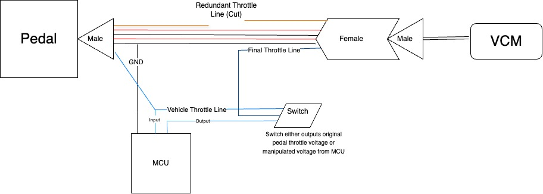
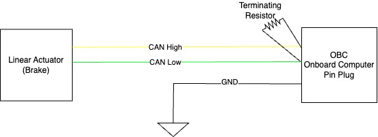

# Schematics

## Main Nova Schematic (outdated)

---

## Throttle Schematic (updated 05/2024)

---

## Brake (LA CAN BUS) Schematic (updated 05/2024)

---

## Power Source Schematics (outdated)

---

## USB Hub Schematics (outdated)

---

## Adafruit Grand Central Schematics (outdated)

---

## CAN Bus Systems

 

---

## EPAS 

